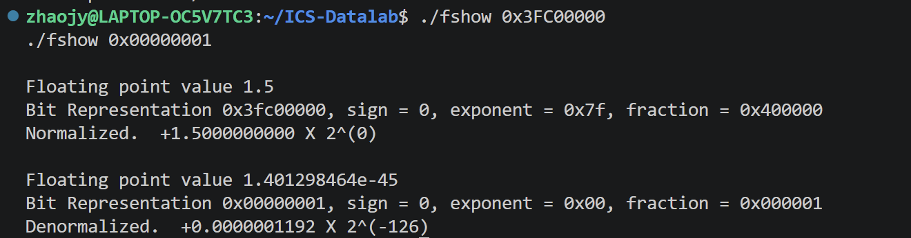
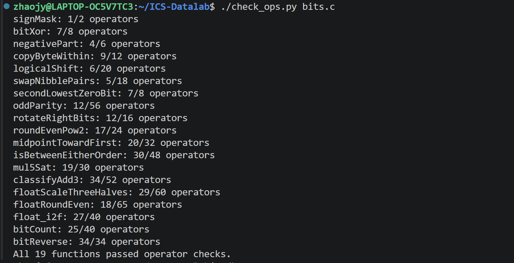
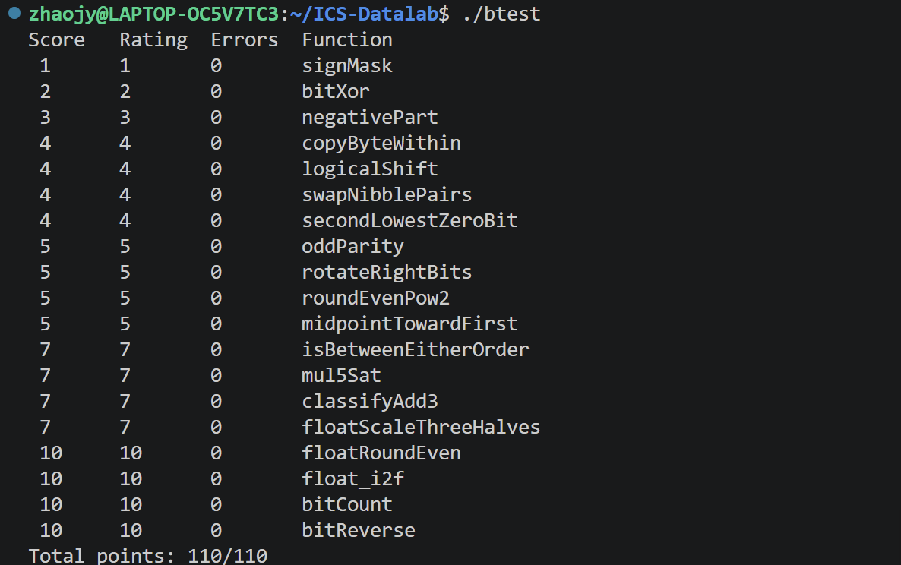
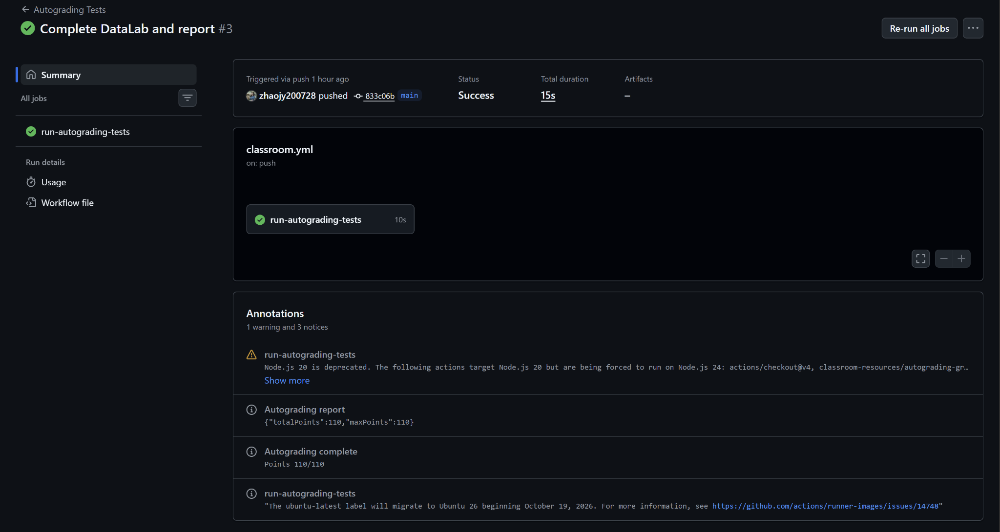

# Lab1: DataLab 实验报告

> **姓名**：赵静怡  
> **学号**：25800680034  
> **实验环境**：Windows 11 / WSL2 Ubuntu / VS Code  
---

## 目录

- [1. 实验目标与环境](#1-实验目标与环境)
- [2. 基础位运算：P1–P7](#2-基础位运算p1p7)
- [3. 位级算法与舍入：P8–P10](#3-位级算法与舍入p8p10)
- [4. 整数边界与溢出：P11–P14](#4-整数边界与溢出p11p14)
- [5. IEEE 754 浮点数处理：P15–P17](#5-ieee-754-浮点数处理p15p17)
- [6. 并行位算法：P18–P19](#6-并行位算法p18p19)
- [7. 编译、测试与自动评分](#7-编译测试与自动评分)
- [8. 实验总结](#8-实验总结)
- [9. 参考资料与辅助工具](#9-参考资料与辅助工具)

---

## 1. 实验目标与环境

### 1.1 实验目标

DataLab 的主要任务是在 `bits.c` 中完成 19 个函数。实验并不强调常规 C 语言程序设计，而是限制可使用的运算符和控制结构，使整数补码、掩码、移位、整数溢出以及 IEEE 754 浮点表示能够直接落实到位级操作中。

其中，整数题主要限制在 `! ~ & ^ | + << >>` 等运算符内，不能通过 `if`、循环、比较运算符或大常量直接完成判断；浮点题允许使用更多整数运算和控制结构，但仍不能直接使用浮点运算。因此，本实验的核心是把“条件判断”“比较”“舍入”“溢出”等高层语义转换成可观察的 bit pattern。

### 1.2 实验环境

实验在 Windows 11 的 WSL2 Ubuntu 环境中完成，代码编辑使用 VS Code Remote WSL。本地仓库位于：

```text
~/ICS-Datalab
```

主要使用的工具与文件包括：

| 工具 / 文件 | 用途 |
|---|---|
| `bits.c` | 19 道题的实现文件 |
| `make clean && make all` | 清理旧产物并重新编译 |
| `./btest -f <function>` | 单独测试指定函数 |
| `./btest` | 对全部 19 个函数进行正确性测试 |
| `./check_ops.py bits.c` | 检查运算符种类及数量是否合法 |
| `./fshow` | 查看 IEEE 754 单精度浮点数的位级解释 |
| GitHub Actions | 在线自动评分与最终校验 |

实验过程中仅修改规定的 `bits.c` 并新增实验报告及图片，没有修改 `.github` 中的自动评分 workflow。

### 1.3 实验工作流


调试时优先使用单函数测试定位问题，全部函数完成后再进行完整合法性检查和总测试。这样可以把“功能错误”和“运算符违规”分开处理，避免在最后统一排查大量问题。

---

## 2. 基础位运算：P1–P7

### P1 `signMask`：构造符号位掩码

**目标：** 返回 `0x80000000`，即 32 位整数中只有最高位为 `1`。

32 位整数的 bit 从最低位开始编号为 0～31，因此目标可以理解为把最低位的 `1` 移动到 bit 31。由于整数题不能直接使用大常量 `0x80000000`，采用“小常量 + 移位”的方式构造：

```c
return 1 << 31;
```

位模式为：

```text
00000000 00000000 00000000 00000001
                << 31
10000000 00000000 00000000 00000000
```

该结果既是本题答案，也是后续构造 `INT_MIN`、提取符号信息时反复使用的基础模式。

---

### P2 `bitXor`：仅用 `~` 和 `&` 实现异或

**目标：** 在禁止使用 `^` 的条件下，只使用 `~` 和 `&` 得到 `x ^ y`。

对单个 bit 而言，异或为 `1` 的条件是两个输入不同。可以从反面描述为：两个输入不能同时为 `1`，也不能同时为 `0`。

- `x & y` 标记“同时为 1”的位置，因此 `~(x & y)` 排除这种情况；
- `~x & ~y` 标记“同时为 0”的位置，因此 `~(~x & ~y)` 排除另一种情况。

最终：

```c
~(x & y) & ~(~x & ~y)
```

这个表达式对 32 个 bit 并行生效，相当于用德摩根律把异或拆成题目允许的基本布尔操作。

---

### P3 `negativePart`：使用符号掩码完成条件选择

**目标：** `x < 0` 时返回 `-x`，否则返回 `0`。

补码中取负可表示为：

```text
-x = ~x + 1
```

关键是不能使用 `if` 判断 `x` 的正负。算术右移可以直接生成选择掩码：

```c
int mask = x >> 31;
```

其结果为：

```text
x >= 0 : 00000000 00000000 00000000 00000000
x <  0 : 11111111 11111111 11111111 11111111
```

因此：

```c
return (~x + 1) & mask;
```

非负输入会被全 0 掩码清零，负数则被全 1 掩码完整保留。这个形式本质上是用 mask 实现无分支条件选择。

---

### P4 `copyByteWithin`：提取、清空与写入字节

**目标：** 将 `x` 的第 `src` 个字节复制到第 `dst` 个字节，其余位保持不变。

32 位整数按字节可以表示为：

```text
31              24 23              16 15               8 7                0
┌────────────────┬──────────────────┬──────────────────┬──────────────────┐
│     byte 3     │      byte 2      │      byte 1      │      byte 0      │
└────────────────┴──────────────────┴──────────────────┴──────────────────┘
```

由于每个 byte 占 8 bit，源和目标偏移分别为：

```c
int shiftSrc = src << 3;
int shiftDst = dst << 3;
```

第一步提取源字节：

```c
int byte = (x >> shiftSrc) & 0xFF;
```

第二步构造目标位置的 8 位掩码并清空原目标字节：

```c
int mask = 0xFF << shiftDst;
x & ~mask
```

第三步把源字节移动到目标位置并拼回：

```c
return (x & ~mask) | (byte << shiftDst);
```

以 `0x11223344, src=0, dst=2` 为例：

```text
原始：      11 22 33 44
提取 byte0:          44
清空 byte2: 11 00 33 44
写入：      11 44 33 44
```

这里需要先清空再写入，如果直接使用 `|`，目标字节中原本为 `1` 的 bit 无法被覆盖为 `0`。

---

### P5 `logicalShift`：用掩码修正算术右移

**目标：** 对有符号整数实现逻辑右移。

实验环境中的 `>>` 对负数执行算术右移，即左侧补符号位 `1`；逻辑右移则要求左侧始终补 `0`。因此可以先执行 `x >> n`，再用掩码清除符号扩展产生的高位 `1`。

需要的掩码满足：最高 `n` 位为 `0`，其余位为 `1`。代码构造为：

```c
int mask = ~(((1 << 31) >> n) << 1);
```

其变化可以理解为：

```text
1000...0000
    >> n       -> 高位形成连续 1
    << 1       -> 保留恰好 n 个高位 1
    ~          -> 高 n 位变 0，其余位变 1
```

最后：

```c
return (x >> n) & mask;
```

对 `n=0`，掩码自然变为全 1，因此原数保持不变。

---

### P6 `swapNibblePairs`：并行交换每个字节的高低半字节

**目标：** 在每个 byte 内交换高 4 bit 和低 4 bit，例如 `0xAB -> 0xBA`，四个字节同时进行。

构造交替掩码：

```text
0x0F0F0F0F = 00001111 00001111 00001111 00001111
```

代码先从小常量 `0x0F` 逐步扩展得到该掩码，然后分别处理两部分：

```c
int low  = (x & mask) << 4;
int high = (x >> 4) & mask;
return low | high;
```

其中 `low` 把各字节的低 nibble 移到高半区；`high` 把原来的高 nibble 移到低半区。即使 `x` 为负数，算术右移产生的高位 `1` 也会被后面的 `& mask` 清除，不影响结果。

---

### P7 `secondLowestZeroBit`：消除最低有效位后再次提取

**目标：** 返回只标记“从低位起第二个 0”位置的掩码。

先取反：

```c
int y = ~x;
```

问题于是从“找第二个最低 0”转换为“找 `y` 中第二个最低 1”。随后利用两个经典补码性质：

1. `a & (a - 1)` 清除最低有效的 `1`；
2. `a & (-a)` 只保留最低有效的 `1`。

由于题目不允许 `-`，分别写成：

```c
int rest = y & (y + ~0);
return rest & (~rest + 1);
```

如果原数中不足两个 `0`，清除第一次最低有效 `1` 后 `rest` 会变成 0，最终自然返回 0，无需单独分支。

---

## 3. 位级算法与舍入：P8–P10

### P8 `oddParity`：XOR 折叠计算奇校验位

**目标：** 原始 32 位中 `1` 的数量为偶数时返回 1，为奇数时返回 0，使附加该校验位后总 `1` 数为奇数。

异或可以表示“1 的数量模 2”的结果，因此不需要真正计算 bit count，只需要把全部 32 位的奇偶信息折叠到最低位。实现依次执行：

```c
x = x ^ (x >> 16);
x = x ^ (x >> 8);
x = x ^ (x >> 4);
x = x ^ (x >> 2);
x = x ^ (x >> 1);
```

每轮把两组信息压缩到一组：

```text
32 bit
  ↓ XOR folding
16 bit
  ↓
 8 bit
  ↓
 4 bit
  ↓
 2 bit
  ↓
 1 bit
```

最终最低位表示原数中 `1` 个数的奇偶性。由于题目要求“奇校验位”，返回：

```c
!(x & 1)
```

---

### P9 `rotateRightBits`：逻辑右移与回绕位拼接

**目标：** 将 32 位整数循环右移 `n` 位，从右侧移出的 bit 重新进入最高位。

循环右移可以拆成两部分：

```text
主体 = logical_right_shift(x, k)
回绕 = x << (32-k)
结果 = 主体 | 回绕
```

其中有效位移量：

```c
int k = n & 31;
```

相当于 `n mod 32`。为了避免 `k=0` 时执行非法的左移 32 位，用补码和低五位得到合法位移：

```c
int left = (~k + 1) & 31;
```

以右移 8 位为例：

```text
0x12345678

00010010 00110100 01010110 01111000
                                  └────────────┐
                                               │ rotate 8
01111000 00010010 00110100 01010110  <────────┘

0x78123456
```

主体部分复用逻辑右移掩码，清除算术右移的符号扩展：

```c
int mask = ~(((1 << 31) >> k) << 1);
int right = (x >> k) & mask;
int wrap = x << left;
return right | wrap;
```

---

### P10 `roundEvenPow2`：利用余数位实现 ties-to-even

**目标：** 把非负整数 `x` 舍入到最接近的 `2^n` 倍数；正好处于两倍数中间时，选择商为偶数的一侧。

将 `x` 写为：

```text
x = q * 2^n + r
```

其中：

```c
int q = x >> n;
```

中点为 `2^(n-1)`。代码通过：

```c
int half = 1 << (n + ~0);
int halfBit = !!(x & half);
int lowBit = !!(x & (half + ~0));
```

分别判断：

- 余数是否达到一半；
- 除了中点位之外是否还有更低的 `1`。

因此：

```c
int roundUp = halfBit & (lowBit | (q & 1));
```

恰好一半时，只有 `q` 为奇数才进位，使最终商成为偶数。

| 输入 | 相邻倍数 | 中点情况 | 舍入结果 |
|---:|---|---|---:|
| `10, n=2` | 8 / 12 | 恰好一半，商 2 / 3 | 8 |
| `14, n=2` | 12 / 16 | 恰好一半，商 3 / 4 | 16 |

最终返回 `(q + roundUp) << n`。

---

## 4. 整数边界与溢出：P11–P14

### P11 `midpointTowardFirst`：无溢出计算整数中点

**目标：** 计算精确数学中点 `(x+y)/2`，不能因 `x+y` 溢出而错误；若中点位于两个整数正中间，则选择更靠近第一个参数 `x` 的整数。

直接 `(x+y)>>1` 可能在两个大正数或两个大负数相加时溢出。使用恒等式：

```text
x + y = 2 * (x & y) + (x ^ y)
```

可得到安全的向下取整中点：

```c
int midpoint = (x & y) + ((x ^ y) >> 1);
```

之后需要判断是否存在 `.5`，以及是否应向较大的方向补 1。`(x ^ y) & 1` 可以判断 `x+y` 是否为奇数。

判断 `x < y` 时不能简单观察 `x-y` 的符号，因为减法也可能溢出。代码先比较符号：

- 异号时，负数一定更小；
- 同号时，`x-y` 不会产生导致比较失真的溢出，可以通过差值符号判断。

最终：

```c
return midpoint + (odd & !isLess);
```

当中点恰好处于两个整数之间且 `x > y` 时补 1，否则保持向下取整结果，从而实现“toward first”。

---

### P12 `isBetweenEitherOrder`：无需确定端点顺序的区间判断

**目标：** 判断 `x` 是否处于由 `a`、`b` 构成的闭区间内，且 `a`、`b` 的顺序可能任意。

先分别安全判断：

```text
lessA = (x < a)
lessB = (x < b)
```

如果 `x` 严格位于两个端点之间，则两个比较结果必然不同：

```text
x 在左侧：1,1
x 在中间：0,1 或 1,0
x 在右侧：0,0
```

因此 `lessA ^ lessB` 可以检测严格位于两端点之间的情况。为了包含端点，再补上：

```c
!(x ^ a)
!(x ^ b)
```

最终：

```c
!!((lessA ^ lessB) | !(x ^ a) | !(x ^ b))
```

比较部分继续使用 P11 中的“先看符号、同号再做差”方法，避免 `x-a` 或 `x-b` 的溢出影响比较结果。

---

### P13 `mul5Sat`：乘 5 溢出时执行饱和处理

**目标：** 计算 `5*x`；若正向溢出则返回 `INT_MAX`，负向溢出则返回 `INT_MIN`。

首先用移位和加法得到候选结果：

```c
int four = x << 2;
int five = four + x;
```

溢出检测分两部分：

1. `four` 是否已经在左移两位时丢失了高位信息；
2. `four + x` 是否发生同号相加后的符号翻转。

第一部分：

```c
int lost = (four >> 2) ^ x;
```

若没有丢失有效高位，左移后再算术右移应能恢复原数；否则 `lost != 0`。

第二部分：

```c
int flipped = (five ^ x) >> 31;
```

`4x` 与 `x` 本应同号，若相加后结果符号与 `x` 不同，说明发生了溢出。

组合得到 `overflow` 后，将其扩展成全 0 / 全 1 掩码。饱和值根据原输入符号选择：

```text
x >= 0 -> INT_MAX = 0x7fffffff
x <  0 -> INT_MIN = 0x80000000
```

最后通过 mask 在正常结果 `five` 与饱和值 `bound` 之间无分支选择。

---

### P14 `classifyAdd3`：判断三个整数的精确数学和是否越界

**目标：** 不使用更宽整数类型，判断精确数学和 `x+y+z` 是否大于 `INT_MAX`、小于 `INT_MIN`，或仍在 32 位有符号范围内。

三个数相加的难点在于：**中间步骤发生溢出，并不意味着最终精确和一定越界。** 例如：

```text
INT_MAX + INT_MAX - INT_MAX

第一步：
INT_MAX + INT_MAX
→ 32-bit result = -2
→ 正向溢出

第二步：
-2 + (-INT_MAX)
→ 32-bit result = INT_MAX
→ 负向溢出

精确数学结果 = INT_MAX
最终并未越界
```

因此代码记录两次加法：

```c
int s1 = x + y;
int s2 = s1 + z;
```

对于一次有符号加法，只有两个操作数同号、结果变号时才溢出：

```c
int over1 = (~(sx ^ sy)) & (sx ^ ss1);
int over2 = (~(ss1 ^ sz)) & (ss1 ^ ss2);
```

随后根据溢出发生前的符号区分正向和负向溢出，并分别记录 `posMask`、`negMask`。如果两个方向都出现，说明两次回绕互相抵消；只有单一方向存在时，精确和才真正越界。

最终将正向标志映射为 `1`、负向标志映射为 `-1`，无越界时返回 `0`。

---

## 5. IEEE 754 浮点数处理：P15–P17

### 5.1 单精度浮点数位结构

P15–P17 不允许直接进行浮点运算，而是把一个 `unsigned` 的 32 位内容解释为 IEEE 754 single precision：

```text
31            30                    23 22                         0
┌─────────────┬──────────────────────┬────────────────────────────┐
│ sign (1bit) │ exponent (8 bits)    │ fraction (23 bits)         │
└─────────────┴──────────────────────┴────────────────────────────┘
```

| `exp` | 类型 | 有效数形式 | 说明 |
|---:|---|---|---|
| 0 | 0 / 非规格化数 | `0.fraction` | 无隐藏的前导 1 |
| 1–254 | 规格化数 | `1.fraction` | 存在隐藏的前导 1 |
| 255 | Inf / NaN | 特殊编码 | 需单独处理 |

使用 `fshow` 对规格化数 `1.5` 与最小正非规格化数进行对比：

<div align="center">


*图 1　`fshow` 对规格化数与非规格化数的解释结果*
</div>

该结果直观显示了规格化数与非规格化数在 exponent、fraction 和隐藏位上的差别，为后续三题的编码操作提供了参考。

---

### P15 `floatScaleThreeHalves`：位级实现 `f * 3 / 2`

**目标：** 在不进行浮点运算的情况下返回 `f*1.5` 的 IEEE 754 编码，并采用 round-to-nearest-even。

首先拆分字段：

```c
sign = uf & 0x80000000u
exp  = (uf >> 23) & 0xFFu
frac = uf & 0x7FFFFFu
```

处理分为三类：

1. **`exp == 255`**：NaN 和无穷大直接返回原编码；
2. **`exp == 0`**：零与非规格化数，没有隐藏位；
3. **`1 <= exp <= 254`**：规格化数，需要恢复隐藏的前导 `1`。

对规格化数，先恢复 24 位有效数：

```c
mant |= 0x800000u;
```

再计算 `triple = mant * 3`。乘 3 后根据位宽判断需要右移 1 位还是 2 位，使结果重新落回 24 位有效数范围。被右移舍弃的部分通过 `remainder`、`halfway` 判断是否需要 round-to-nearest-even：

```text
remainder < halfway  -> 不进位
remainder > halfway  -> 进位
remainder = halfway  -> 保留部分为奇数时进位
```

非规格化数同样对 `3*mant/2` 执行 ties-to-even。若结果跨过非规格化与规格化的边界，bit pattern 会自然进入 exponent=1 的表示范围。规格化数在舍入后若有效数再次产生进位，则还需要右移并增加阶码；若阶码达到 255，则返回同号无穷大。

这道题同时覆盖了非规格化数、规格化数、舍入、重新规格化和溢出到 Infinity 等多个 IEEE 754 边界情况。

---

### P16 `floatRoundEven`：浮点数舍入到最近整数

**目标：** 将 `uf` 表示的浮点数舍入为最近整数，并仍以单精度浮点编码返回；中点采用 ties-to-even，舍入成 0 时保留正负号。

根据 biased exponent 可以直接判断二进制小数点的位置：

- `exp < 126`：绝对值小于 0.5，结果为带原符号的 `±0`；
- `exp == 126`：绝对值位于 `[0.5,1)`，需要区分恰好 0.5 与大于 0.5；
- `127 <= exp < 150`：整数位和小数位同时存在；
- `exp >= 150`：实际指数至少为 23，全部 fraction 都位于整数部分，原数已经是整数；
- `exp == 255`：NaN / Infinity 原样返回。

对于中间情况，需要舍弃的低位数为：

```c
shift = 150 - exp;
```

构造：

```c
mask = (1u << shift) - 1u;
```

提取被舍弃的小数部分并把原编码对应低位置零。之后比较 `remainder` 与 `half`；恰好一半时，通过被保留的最低整数位判断奇偶，从而决定是否把 `1 << shift` 加回编码。

该题的关键在于：这里处理的是浮点编码中的有效位位置，而不是把 `uf` 当作普通整数做数值舍入。

---

### P17 `float_i2f`：整数转换为 IEEE 754 单精度编码

**目标：** 实现 `(float)x` 的位级效果，但禁止直接类型转换。

首先处理符号和绝对值。`INT_MIN` 的数学绝对值无法存入有符号 `int`，因此使用 `unsigned mag` 保存 magnitude，并通过补码：

```c
mag = ~mag + 1u;
```

得到负数的无符号绝对值。

随后不断右移 `mag` 找到最高有效 `1` 的位置 `msb`。对整数：

```text
实际指数 e = msb
存储阶码 E = msb + 127
```

若 `msb <= 23`，所有有效位均能放入 float 的 24 位精度（23 位 fraction + 1 个隐藏位），只需要左移对齐后去掉隐藏位。

若 `msb > 23`，整数的有效 bit 超过 float 能精确保存的范围，需要舍弃低位：

```c
shift = msb - 23;
mant = mag >> shift;
```

对被舍弃部分继续执行 round-to-nearest-even。若舍入导致 24 位有效数从 `0xFFFFFF` 进位为 `1<<24`，则需要再次右移，并把 exponent 增加 1。

该处理解释了为什么某些大整数转换为 float 后不再精确。例如 `16777217 = 2^24 + 1` 已超过单精度浮点的 24 位有效精度，转换时会舍入到相邻可表示值。

---

## 6. 并行位算法：P18–P19

### P18 `bitCount`：分组并行统计 1 的数量

**目标：** 计算 32 位整数中 bit `1` 的总个数，不能使用循环逐位扫描。

算法采用分治式 parallel bit counting。先构造三组掩码：

```text
0x55555555 = 01010101 ...   每 2 位分组
0x33333333 = 00110011 ...   每 4 位分组
0x0F0F0F0F = 00001111 ...   每 8 位分组
```

由于整数题限制大常量，三个掩码都从 `0x55`、`0x33`、`0x0F` 等小常量通过移位与 `|` 逐步扩展得到。

统计过程：

```text
32 个独立 bit
      ↓ 每 2 位求和
16 个 2-bit 组
      ↓ 每 4 位合并
 8 个 4-bit 组
      ↓ 每 8 位合并
 4 个 byte 计数
      ↓ >> 8 后相加
 2 个 16-bit 计数
      ↓ >> 16 后相加
 1 个 32-bit 总计数
```

前三轮分别执行：

```c
x = (x & mask1) + ((x >> 1) & mask1);
x = (x & mask2) + ((x >> 2) & mask2);
x = (x & mask4) + ((x >> 4) & mask4);
```

之后使用 `x + (x >> 8)`、`x + (x >> 16)` 汇总到最低部分。32 位最多包含 32 个 `1`，因此最后只需 `x & 0x3F` 保留最低 6 位。

---

### P19 `bitReverse`：逐级交换完成 32 位逆序

**目标：** 将 32 位整数的 bit 顺序完全反转，同时操作符上限只有 34。

逐 bit 交换会需要大量操作，因此采用五层分治：

```text
原始 32 bit
    ↓ 交换两个 16-bit 半区
 16 | 16
    ↓ 每个 16-bit 内交换 8-bit
8 | 8 | 8 | 8
    ↓ 每个 byte 内交换 4-bit
4 | 4 | 4 | 4 | ...
    ↓ 每组 4-bit 内交换 2-bit
2 | 2 | 2 | 2 | ...
    ↓ 交换所有相邻 bit
1 | 1 | 1 | 1 | ...
    ↓
完整 bit reverse
```

第一步使用 `0x0000FFFF` 型掩码交换高低 16 位：

```c
x = ((x >> 16) & mask) | (x << 16);
```

为了满足严格的 34 个运算符上限，后续不重新从头构造四个新掩码，而是不断利用当前 mask 变换：

```text
0x0000FFFF
   XOR (<< 8) -> 0x00FF00FF
   XOR (<< 4) -> 0x0F0F0F0F
   XOR (<< 2) -> 0x33333333
   XOR (<< 1) -> 0x55555555
```

每得到一个新掩码，就分别提取左右半组，移位后再 `|` 合并。最终实现刚好使用 `34/34` 个运算符，是整个实验中操作数约束最紧的一题。

---

## 7. 编译、测试与自动评分

### 7.1 调试方式

修改 `bits.c` 后首先重新编译：

```bash
make clean && make all
```

单题调试使用：

```bash
./btest -f <function>
```

这种方式可以在每完成一道题后立即检查边界测试是否通过，避免把多个函数的问题积累到最后。

### 7.2 运算符合法性检查

全部题目完成后运行：

```bash
./check_ops.py bits.c
```

19 个函数全部通过运算符检查：

<div align="center">


*图 2　19 个函数全部通过运算符种类和数量检查*
</div>

检查结果中的实际操作符使用情况如下：

| 题号 | 函数 | Ops | 上限 | 题号 | 函数 | Ops | 上限 |
|---|---|---:|---:|---|---|---:|---:|
| P1 | `signMask` | 1 | 2 | P11 | `midpointTowardFirst` | 20 | 32 |
| P2 | `bitXor` | 7 | 8 | P12 | `isBetweenEitherOrder` | 30 | 48 |
| P3 | `negativePart` | 4 | 6 | P13 | `mul5Sat` | 19 | 30 |
| P4 | `copyByteWithin` | 9 | 12 | P14 | `classifyAdd3` | 34 | 52 |
| P5 | `logicalShift` | 6 | 20 | P15 | `floatScaleThreeHalves` | 29 | 60 |
| P6 | `swapNibblePairs` | 5 | 18 | P16 | `floatRoundEven` | 18 | 65 |
| P7 | `secondLowestZeroBit` | 7 | 8 | P17 | `float_i2f` | 27 | 40 |
| P8 | `oddParity` | 12 | 56 | P18 | `bitCount` | 25 | 40 |
| P9 | `rotateRightBits` | 12 | 16 | P19 | `bitReverse` | **34** | **34** |
| P10 | `roundEvenPow2` | 17 | 24 |  |  |  |  |

P19 恰好达到规定上限，其余函数均留有余量。

### 7.3 完整正确性测试

运行：

```bash
./btest
```

19 个函数均为 `Errors = 0`，本地总分为 `110/110`：

<div align="center">


*图 3　完整 `btest` 测试结果：110/110*
</div>

### 7.4 GitHub Actions 在线自动评分

本地测试完成后将仓库推送至 GitHub，自动触发课程提供的 `Autograding Tests` workflow。线上运行状态为 `Success`，Autograding report 显示：

```text
{"totalPoints":110,"maxPoints":110}
Points 110/110
```

<div align="center">


*图 4　GitHub Actions 在线自动评分通过，Points 110/110*
</div>

本地 `check_ops`、本地 `btest` 与线上 GitHub Actions 三层检查结果一致。


---

## 8. 实验总结

DataLab 的主要难点并不是 C 语言语法，而是把平时通过条件分支、比较运算、乘除法或类型转换直接完成的操作，重新表达为固定宽度二进制上的位操作。

整数部分首先建立了几类反复使用的基本方法：利用算术右移生成全 0 / 全 1 的符号掩码；利用 `~x+1` 表示补码取负；通过 mask 完成字段提取、清空和拼接；通过符号关系而不是直接比较处理可能溢出的大小判断。在 P11–P14 中，这些基础操作进一步用于无溢出的中点计算、区间判断、饱和算术和三数精确和分类，使“整数溢出”从抽象概念变成了可以通过 bit pattern 检测和修正的具体行为。

浮点部分则把 IEEE 754 的 sign、exponent、fraction 三个字段直接用于运算。P15–P17 涉及规格化数、非规格化数、隐藏位、阶码偏置以及 round-to-nearest-even，并处理了 NaN、Infinity、±0、有效位溢出等边界情况。通过 `fshow` 的输出可以直接观察编码字段与实际浮点值之间的对应关系。

最后两题展示了位运算中的并行与分治思想：`bitCount` 不逐位扫描，而是在 2、4、8、16、32 位分组上逐层合并计数；`bitReverse` 也不是逐位交换，而是按 16、8、4、2、1 位粒度逐级交换，并通过复用掩码将操作数控制在规定上限内。

最终 19 个函数均通过合法运算符检查，本地测试和 GitHub Actions 自动评分均达到 110/110。

---

## 9. 参考资料与辅助工具

1. **ICS-26Fall-FDU Lab1: DataLab 实验文档**  
   `https://ics-26fall-fdu.github.io/labs/lab1-data-lab/`

2. **ICS-26Fall-FDU DataLab 模板仓库**  
   `https://github.com/ICS-26Fall-FDU/DataLab`


